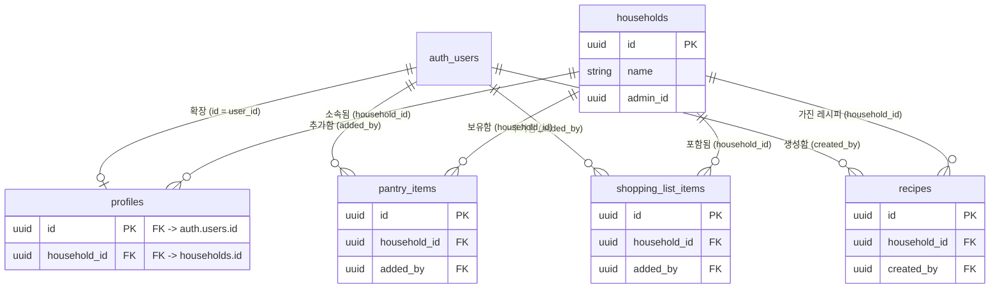

# aistudio's Project 데이터베이스 아키텍처

이 문서는 `aistudio's Project`의 Supabase `public` 스키마 내 핵심 테이블 구조와 상호 관계성(Foreign Keys)을 분석한 ER(Entity-Relationship) 다이어그램 및 설명서입니다.

## 📌 데이터베이스 아키텍처 다이어그램 (ERD)

---

## 🔍 테이블 간 상세 관계 설명

해당 데이터베이스는 **냉장고 공유 미니 앱(가족 기반 식료품/레시피 관리)** 에 적합하게, `households(가정/그룹)` 구조와 `users(유저 계정)`을 중심으로 단단하게 모델링되어 있습니다.

### 1. `households` (그룹/중심 참조 테이블)
- 애플리케이션의 핵심 그룹 단위입니다. (예: 가족, 룸메이트 등)
- 시스템 내의 거의 모든 핵심 데이터(식자재, 쇼핑 리스트, 레시피, 유저 프로필)가 그룹핑을 위해 `household_id` 외래키를 사용해 이 테이블을 바라봅니다. (**1 : N 관계**)
  - `profiles.household_id` 👉 `households.id`
  - `pantry_items.household_id` 👉 `households.id`
  - `shopping_list_items.household_id` 👉 `households.id`
  - `recipes.household_id` 👉 `households.id`

### 2. `auth.users` (사용자 인증 서버 연동)
- `public` 스키마 영역 밖의 인증 계정 관리용 테이블(`auth.users`)이며, 사용자 활동을 추적합니다.
- **`profiles` 테이블 역할 (1 : 1 관계)**: `profiles.id` 컬럼이 `auth.users.id`를 그대로 참조합니다. 이를 통해 사용자 이름, 권한(viewer/editor 등), 구독 상태를 관리합니다.
- **활동 주체 추적 (1 : N 관계)**:
  - `pantry_items.added_by`: 식자재 추가자 추적
  - `shopping_list_items.added_by`: 쇼핑 리스트 추가자 추적
  - `recipes.created_by`: 레시피 생성자 추적

> 💡 **Tip / 제안 사항**
> 현재 `households` 테이블에 `admin_id` (관리자 계정 ID) 컬럼이 존재하지만, 공식적인 외래키(Foreign Key) 제약 조건이 해당 컬럼에는 등록되어 있지 않습니다. 향후 데이터의 일관성 및 무결성 보장을 위해 해당 컬럼이 `auth.users.id`를 향하도록 제약(Constraint)을 추가해 두는 것도 좋은 방안입니다.
